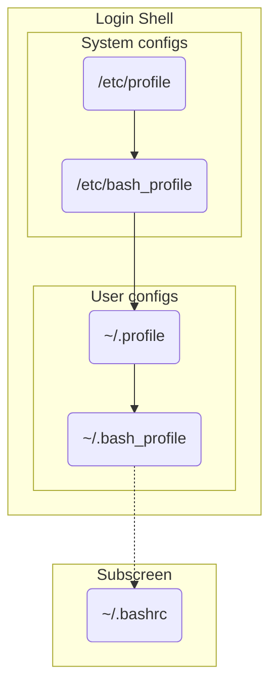

## profile file

- Read by login shell
- .profile is read by many shells in the absence of their own shell-specific config files.

## bash_profile

- Readby login shell(Bash)

## bashrc

- Subshells read only .bashrc.
- Shell script 開頭

  ```bash
  #!/bin/bash
  ```

  會讀取 bashrc 相關變數

## Login shell

- 使用 su 切換使用者

## Subshell

- screen
- tmux



## Reference

- <https://serverfault.com/questions/261802/what-are-the-functional-differences-between-profile-bash-profile-and-bashrc>
