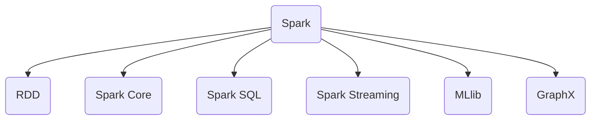

## What is Spark

- Spark 是一個開源叢集式運算，用來替代 Hadoop Map Reduce 的部分功能

## Spark 特點

- Spark 允許用戶將資料載入至叢集記憶體，並多次對其進行查詢，非常適合用於機器學習演算法
- 提供 Java, Scala, Python 及 R 語言 API
- 記憶體內的快取資料集，可進行互動式資料分析(相對於 Hadoop MapReduce)
- Scala 或 Python 中的互動式命令列介面可降低橫向擴展資料探索的反應時間。
- Spark Streaming 對即時資料串流的處理具有可擴充性、高吞吐量、可容錯性等特點。
- Spark SQL 支援結構化和關聯式查詢處理（SQL）。
- MLlib 機器學習演算法和 Graphx 圖形處理演算法的高階函式庫。

## Spark RDD (Resilient Distributed Dataset)

### RDD 是什麼

- RDD 是 Spark 的抽象 Dataset
- RDD 上面可以進行兩種操作：Transfromation & Action
- RDD 會記錄本身是如何從原始資料得出的，稱為 Lineage
- 支援 Scala, Java 和 Python API ，方法類似操縱本地端的資料庫。
- 支援 long, int 及 String 形態
- RDD 運算分為 Transform 及 Action

### RDD 特點

- Lazy Evaluation  
  數值在 Action 之前，不會真的被計算出來
- In-Memory Computation
- Immutability  
  RDD 被創建之後沒有辦法修改，Transfromation 只會產生一個新的 RDD
- Fault Tolerance  
  可用 Lineage 從 Original Data 重新推算斷線 Node 上面的 Partition。
- Fault Tolerance 最佳化
  Transfromation 函數分為寬依賴及窄依賴，窄依賴的情況下可直接用 Partition 推算 Child Partition，不用整個 RDD。
- Partitioning  
  計算會被指派到 RDD Partition，Partition 的數目直接關係到平行運算的程度。
- Persistence
  可以根據資料是否會重新使用，指定存放在記憶體或磁碟。
- Location-Stickiness  
  RDDs are capable of defining placement preference(information about the location of RDD) to compute partitions. The DAG Scheduler places the partitions in such a way that task is close to data as much as possible, thus speeding up the computation.
- Coarse-Grained Operation  
  RDDs support coarse-grained operations. That means we can perform an operation on entire data set.
- No Limitation  
  RDD 的數目只需要考量記憶體以及硬碟，沒有確切數目上限。

## Spark Core

Spark Core 是整個專案的基礎，提供了分散式任務調度、排程及基本的 I/O。
其基礎的程式抽象被稱為 Resilient Distributed Dataset (RDD)

## Spark SQL

Spark SQL 在 Spark 核心上帶出一種名為 SchemaRDD 的資料抽象化概念，提供結構化和半結構化資料相關的支援。Spark SQL 提供了領域特定語言，可使用 Scala、Java 或 Python 來操縱 SchemaRDDs。它還支援使用使用命令行介面和 ODBC／JDBC 伺服器操作 SQL 語言。在 Spark 1.3 版本，SchemaRDD 被重新命名為 DataFrame。

## Spark Streaming

Spark Streaming 充分利用 Spark 核心的快速排程能力來執行串流分析。它擷取小批次的資料並對之執行 RDD 轉換。這種設計使串流分析可在同一個引擎內使用同一組為批次分析編寫而撰寫的應用程式碼。

## MLlib

MLlib 是 Spark 上分散式機器學習框架。Spark 分散式記憶體式的架構比 Hadoop 磁碟式的 Apache Mahout 快上 10 倍，擴充性甚至比 Vowpal Wabbit 要好。MLlib 可使用許多常見的機器學習和統計演算法，簡化大規模機器學習時間

## GraphX

GraphX 是 Spark 上的分散式圖形處理框架。它提供了一組 API，可用於表達圖表計算並可以類比 Pregel 抽象化。GraphX 還對這種抽象化提供了最佳化運行。

## Reference

- <https://zh.wikipedia.org/zh-tw/Apache_Spark>
- <https://www.quora.com/What-are-the-advantages-of-RDD>
- <https://codertw.com/程式語言/405603/>
